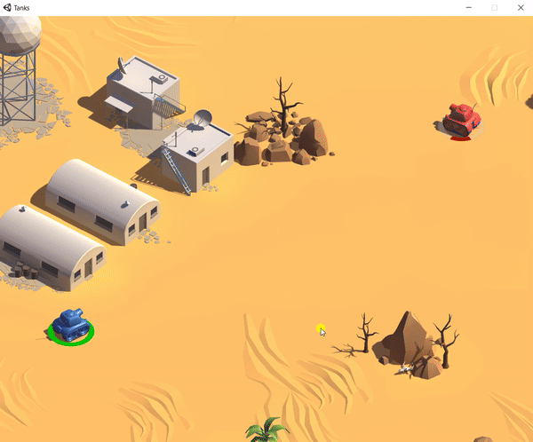

# Unity-Tanks

Tanks is a game created in Unity following [one of its tutorials](https://unity3d.com/es/learn/tutorials/s/tanks-tutorial). Tanks is a 2 player (one keyboard) shooter game, you and a friend will fight during some rounds to demonstrate which tank is the strongest one.

## How to play Tanks

There exists two ways of playing my own version of this game:

### Playing in a browser

Accessing to this [link](https://dauterr.github.io/Tanks/) you are able to try the game.  

Note that the graphic quality will be slightly worst in the browser version of the game than on Windows version. :exclamation::exclamation:

### Playing on Windows

To be able to play on Windows, first you have to download the binaries:

1. First of all, download the [executable](https://github.com/DauteRR/Unity-Tanks/releases/download/1.0.0/Windows.Build.rar).
2. Extract the files.
3. Run **Tanks.exe** and select your graphic configuration.
4. Click **Play!** button and enjoy.

## Game controls

|          Action         	| Button     	|             Description             	|
|:-----------------------:	|:---------:	|:-----------------------------------:	|
|      Player 1 Shoot     	|   Space   	|     Shoot the player 1 tank gun     	|
| Player 1 Horizontal (+) 	|     d     	| Move the player 1 tank to the right 	|
| Player 1 Horizontal (-) 	|     a     	|  Move the player 1 tank to the left 	|
|  Player 1 Vertical (+)  	|     w     	|    Move the player 1 tank forward   	|
|  Player 1 Vertical (-)  	|     s     	|     Move the player 1 tank back     	|
|      Player 2 Shoot     	|   Enter   	|     Shoot the player 2 tank gun     	|
| Player 2 Horizontal (+) 	|   Right   	| Move the player 2 tank to the right 	|
| Player 2 Horizontal (-) 	|    Left   	|  Move the player 2 tank to the left 	|
|  Player 2 Vertical (+)  	|     Up    	|    Move the player 2 tank forward   	|
|  Player 2 Vertical (-)  	|    Down   	|     Move the player 2 tank back     	|

## Game features

* 2 players, 1 keyboard.
* Player VS Player competitive game.
* 5 rounds to win.
* Messages indicating the round.
* Each time a round is finished, the leaderboard will be visible.
* Full control of the tanks.
* Each tank health is visible around the tank.
* Variable shooting power system.
* Explosions.
* Damage fixed to the distance of the explosion to the tank.
* Different audio effects to create an inmersive game experience.

|        Round, movement, variable power shots      |      Round winner, leaderboard, distance damage    |
|             :-------------------------:           |            :-------------------------:             |
|   |   |

## Author

Daute Rodríguez Rodríguez
